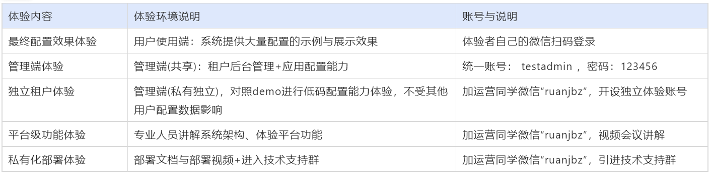

### **项目介绍：**

- JVS是什么？

  JVS是企业级应用构建的基础脚手架，提供开箱即用的基础功能集成，其中集成了 账户管理、租户管理、用户权限体系、三方登录、环境配置、各种业务日志等功能，还提供了对接 低代码、数据中台的能力。

- JVS能解决什么？

  JVS能降低开发团队构建基础框架的难度，能为企业提供完整的一体化、私有部署的数字底座，并提供完整的企业数字化应用的完整的解决方案。基础框架提供100%的源码开源，提供商用级的可插拔应用模块和服务，支持原生应用的开发与低代码/无代码的轻应用的配置拓展。

- JVS和其他产品区别

  JVS不仅仅是一个框架，具备无限的可能性（可以对接低代码式的业务中台与数据中台）；JVS不仅仅是一堆代码，具备专业的支持团队（服务社群）；JVS不仅仅是基础技术，具备多种企业级场景的完备的解决方案与配套的定制开发服务。

### **项目构成**

- 框架前端地址：https://github.com/RKQF-JVS/jvs-ui
- 框架后端地址：https://github.com/RKQF-JVS/jvs

### **体验地址与账号说明**

账号说明：

- 普通用户端：体验者自有微信扫码登录
- 管理端(全网共享)：testadmin  123456
- 管理端+应用编辑：联系运营微信号 ruanjbz，开设独立环境与独立账号
- 管理端+平台配置+应用编辑：联系运营微信号 ruanjbz，获取私有化部署文档与安装包

地址说明：

- 管理平台（含管理平台、低代码）：https://frame.bctools.cn/
- 数据智仓（数据分析平台）：http://bi.bctools.cn/
- 企业文档：http://knowledge.bctools.cn/
- 企业计划（项目管理）：http://teamwork.bctools.cn/
- 企业邮筒（Web邮箱客户端）：http://mailbox.bctools.cn/
- 规则引擎：http://rules.bctools.cn/
- 逻辑引擎：http://logic.bctools.cn/
- 视频会议：http://meeting.bctools.cn/

## 部署视频

https://www.bilibili.com/video/BV15e411u7wQ?share_source=copy_web&vd_source=84d509be6d513ddc55eb13d4bd45cf90

## **体验地址**

开源协议：详见license

**技术文档地址（微信登陆可查看）：**
整体项目文档群 [点击跳转](http://knowledge.bctools.cn/#/view?id=dd37733c43c064ac1c4f1c2155e04ce6)

**技术栈说明：**

|  表现层（前端）              | **组件名称**                               | **组件作用**     | **开源协议** |      |
| -------------- | ------------------------------------------ | ---------------- | ------------ | ---- |
| EsLint    | 前端代码质量检测                                  |MIT  |           |      |
| Vuex           | 前端框架                                   | MIT              |              |      |
| Element-ui     | 前端组件库                                 | MIT              |              |      |
| Crypto-Js      | 前端加密                                   | BSD              |              |      |
| axios          | 基于promise用于浏览器和node.js的http客户端 | MIT              |              |      |
| data-set       | 前端数据绑定                               | MIT              |              |      |
| vue-router     | 前端路由                                   | MIT              |              |      |
| v-charts       | 图形化组件渲染                             | MIT              |              |      |
| E-charts       | 图形化组件渲染                             | Apache 2.0       |              |      |
| WebPack        | 前端代码打包                               | MIT              |              |      |
| G2             | 图形化组件渲染                             | MIT              |              |      |
| G6             | 图形化组件渲染                             | MIT              |              |      |
|                |                                            |                  |              |      |

|应用逻辑层（后端框架） | **组件名称**   | **组件作用**      | **开源协议** |      |
| ---------------------- | -------------- | ----------------- | ------------ | ---- |
| Lombok | 代码精简          | MIT            |        |      |
| Mybatis plus           | 数据持久层     | Apache 2.0        |              |      |
| Hutool                 | 底层工具集     | 木兰宽松许可证 V2 |              |      |
| Swagger                | 在线接口文档   | Apache 2.0        |              |      |
| Groovy                 | 敏捷脚本语言   | Apache 2.0        |              |      |
| Spring boot            | 基础脚手架     | Apache 2.0        |              |      |
| spring cloud alibaba   | 微服务框架     | Apache 2.0        |              |      |
| Xxl-job                | 定时任务       | GNU 3.0           | 通过端口调用 |      |
| Nacos                  | 注册中心       | Apache 2.0        |              |      |
| Sentinel               | 接口限流       | Apache 2.0        |              |      |
| seata                  | 分布式事务处理 | Apache 2.0        |              |      |
| Skywalking             | 链路跟踪       | Apache 2.0        |              |      |
| Redisson               | 分布式锁       | Apache 2.0        |              |      |
| RabbitMq               | 消息队列       | MPL 1.1           |              |      |
| Kafka                  | 分布式消息队列 | Apache 2.0        |              |      |

| 数据存储层 | **组件名称**            | **组件作用**                 | **开源协议** |      |
| ------------ | ----------------------- | ---------------------------- | ------------ | ---- |
| ElasticSearch   |文件搜索引擎（日志、打文本）            | Apache 2.0   |  |      |
| Mongo        | 分布式文件存储数据库    | Apache 2.0                   |              |      |
| Mysql        | 关系型数据库            | GPL                          | 通过端口调用 |      |
| MariaDB      | MYSQL集群               | GNU 2.0                      | 通过端口调用 |      |
| mycat        | 数据分库                |                              |              |      |
| Redis        | 高性能的key-value数据库 | BSD 3                        |              |      |

| **组件归属** | **组件名称** | **组件作用** | **开源协议** |      |
| ------------ | ------------ | ------------ | ------------ | ---- |
| 运维支持层   | Docker       | 容器         | Apache 2.0   |      |
|              |              |              |              |      |

### 技术交流与商务支持

如因人数限制无法加群时，可加运营同学拉入技术交流群

